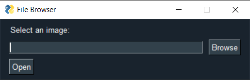
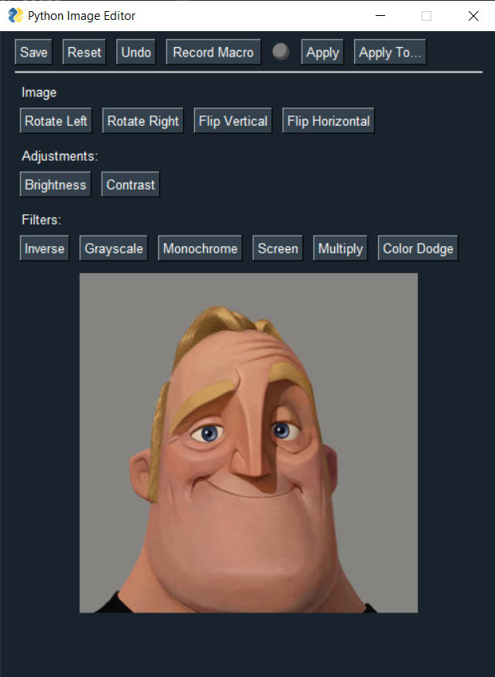
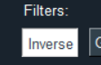
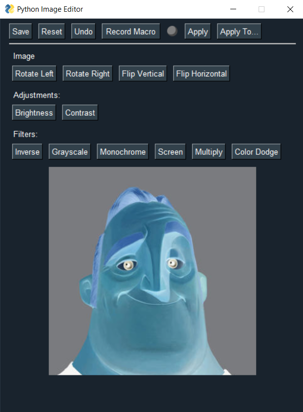
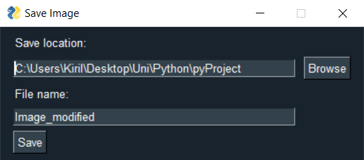
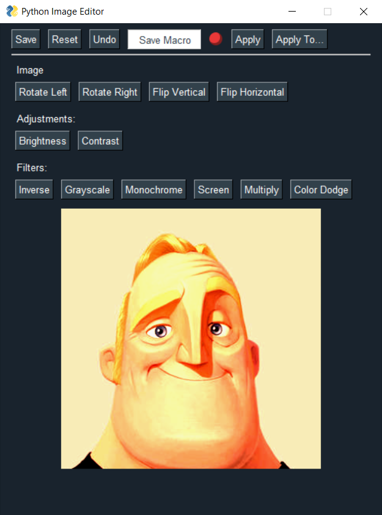
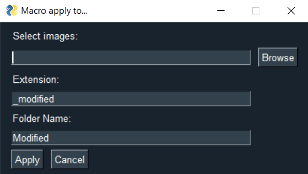

# Python image editor
Python image editor is a simple tool, that can be used for simple image editing purposes.

## Purpose:

### Basic Functionality:
- Load/Save image
- Manipulate image
- Reset image
- Undo change

### Image manipulation:
- Rotate Left/Right
- Flip Vertical/Horizontal 
- Brightness/Contrast
- Inverse
- Grayscale
- Monochrome
- Screen/Multiply/Color Dodge

### Automation:
- Record/Save Macro
- Apply Macro
- Apply Macro to multiple images at once

## Installing and running:
### For ``Windows OS`` the installation is very simple:
1. run ``install_requirements.bat``
2. run ``run.bat``

### For any other OS, it's the standard procedure:
1. open the terminal and locate the directory of the project
2. ``py -m venv venv``
3. ``venv\Scripts\activate``
4. ``pip install -r requirements.txt``
5. ``py main.py``

## Short demo of basic manipulation:
If everything went OK, this is what we should be getting:

In order to Open an image, we first need to provide the text box with a path to that image. This can be done either manually or by pressing ``Browse`` and selecting an image from the File Browser.

After that, press ``Open``.

If there are no problems with the path/image, this is what we should be seeing.

Let's apply the ``Inverse`` filter.

After that we can save the image, via the ``Save`` button.

A popup will appear, and clicking ``Save`` once again will save the image on the given path with the given name.

*Note: The path and file name are set automatically, but they can be changed.*

*Note: All images are saved as .png, hence why you shouldn't add any extension to the file name.  
The file extension cannot be changed as of yet.*

## Short demo of using macros:

You can start recording all of your actions by pressing the ``Record Macro`` button.

You'll know that you are currently recording a macro because the indicator will be glowing red.

After applying some changes, save the steps since pressing ``Record Macro`` by pressing ``Save Macro``.

The indicator should stop glowing, and from here on we can apply (and re-apply) the same macro via the ``Apply`` button at any moment, or apply it to multiple images at once, via the ``Apply To...`` button.

When the ``Apply To...`` button is pressed, a popup will appear.

Again, using ``Browse`` you can navigate to a path and choose multiple images to apply the macro at once.  
In this case, the modified images will be saved in a new folder ``/Modified`` with the extension ``_modified`` after their original name.

## Current limitations:
### Easy to fix:
- You can only export as PNG, although you can open PNG, JPEG/JPG, PPM, GIF, TIFF and BMP images.
- Once an image is loaded up, it cannot be changed until the program is restarted.
### Harder to fix:
- All transparency from transparency-supported image files is flattened to white.
### Very hard to fix:
- All the manipulations are done on the CPU side, instead of the faster alternative - the GPU.
